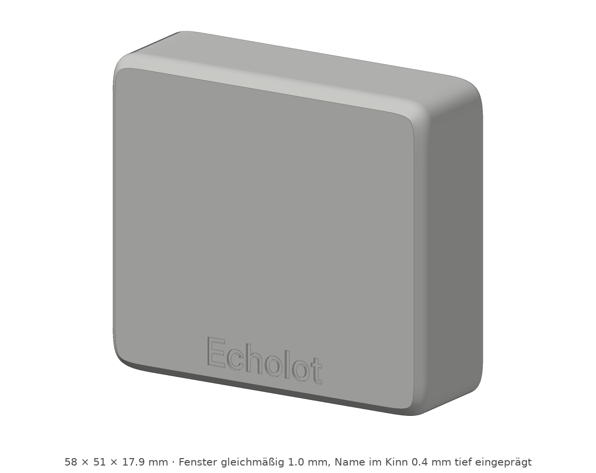
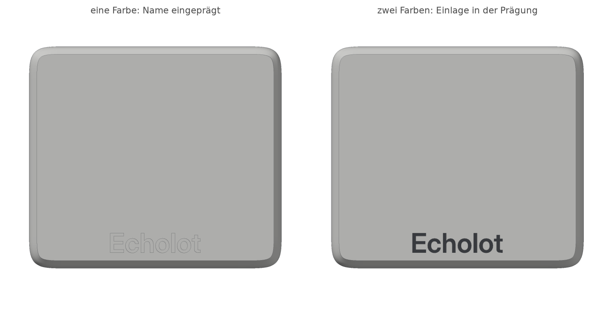
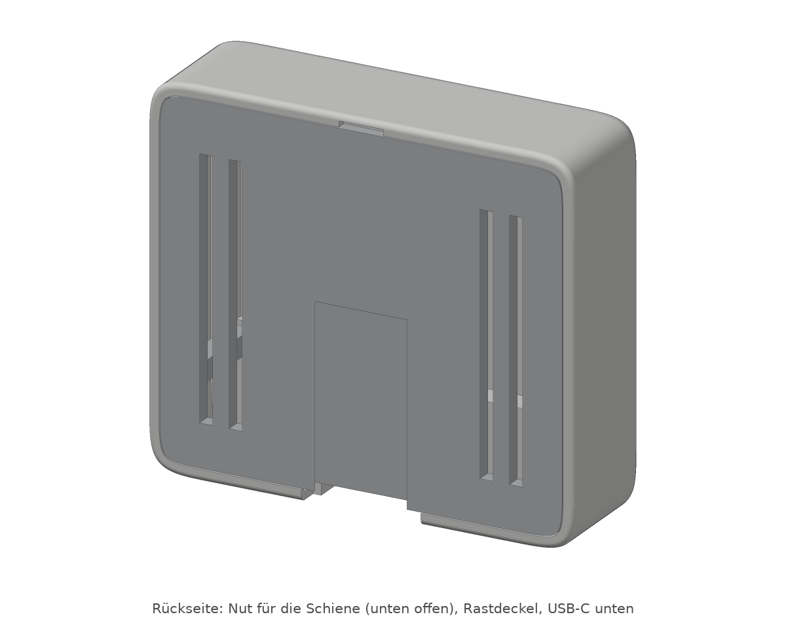
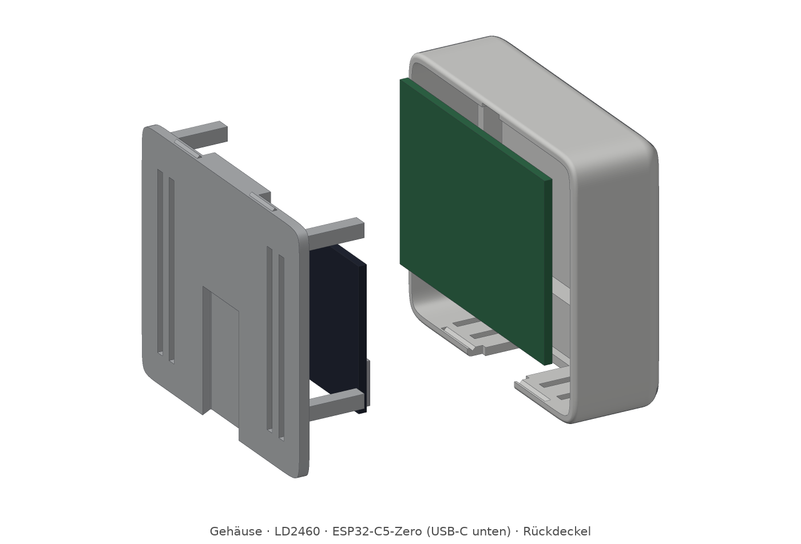
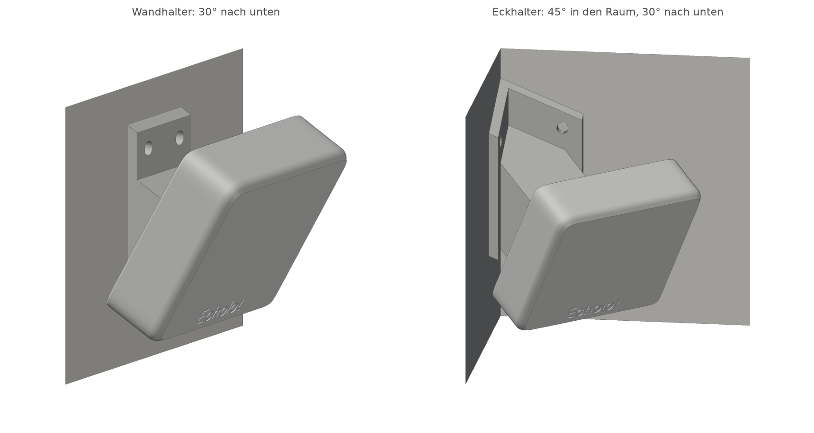
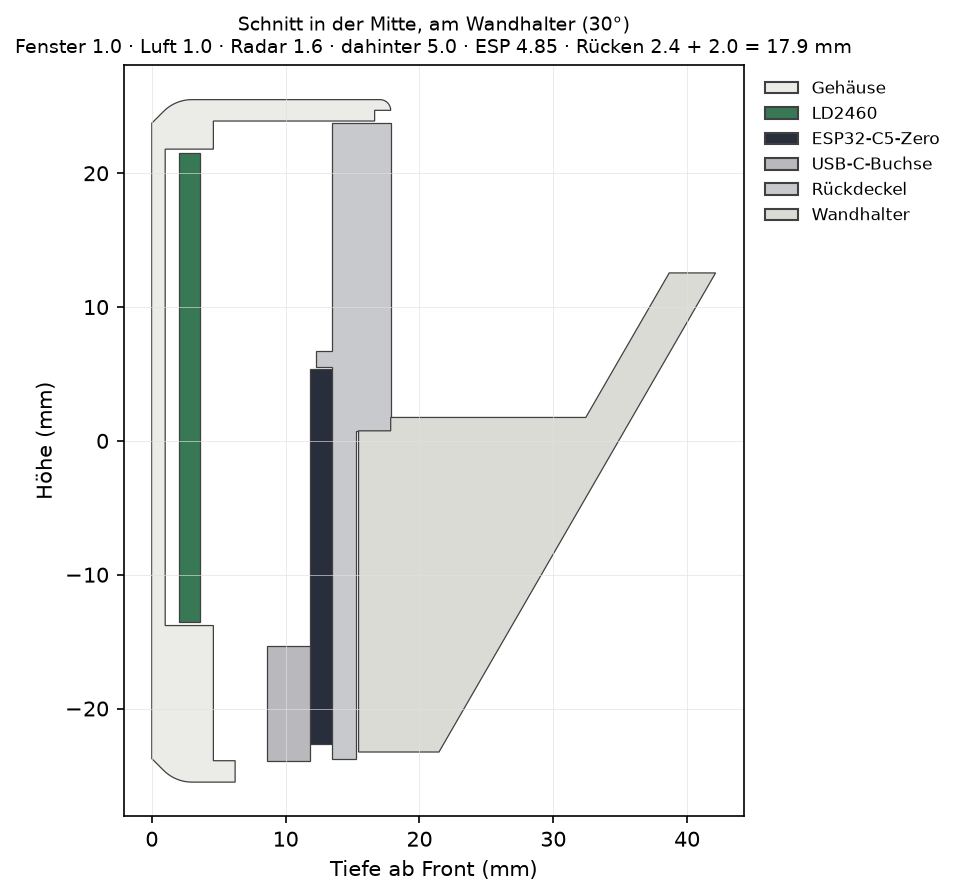

# Gehäuse für LD2460 + ESP32-C5-Zero

Eine schlanke Kachel (58 × 51 × 17,9 mm) für das HLK-LD2460 und den Waveshare
ESP32-C5-Zero, gestaltet in der Art von Apple-Geräten:

- Squircle-Ecken: Die Krümmung setzt sanft ein, ohne Knick.
- Eine weich gerundete Vorderkante.
- Front und Oberseite ohne Schlitze oder Schrauben.
- Unter dem Radarfenster ein schmales „Kinn“ mit dem eingeprägten Namen
  **Echolot** in Inter Display.

Hinter einem gleichmäßig 1 mm dünnen Fenster sitzt das Radar, dahinter der
ESP; das USB-C-Kabel geht unten heraus. Der Rückdeckel rastet
ein und trägt eine Schwalbenschwanz-Nut. Der Sensor wird von oben auf den
Halter geschoben, entweder an der Wand oder in einer Raumecke. Der Halter
gibt die Neigung vor und ist von vorn hinter dem Sensor verborgen.





| | |
| --- | --- |
|  |  |





Alle Bilder sind aus genau der Geometrie gerechnet, die in den STL-Dateien
steht.

## Teile

| Datei | Teil | Lage beim Druck |
| --- | --- | --- |
| `stl/0_passprobe_radar.stl` | die vorderen 5 mm des Gehäuses, zum Probieren | wie im Slicer, Front unten |
| `stl/1_gehaeuse.stl` | Gehäuse | Front unten |
| `stl/2_rueckdeckel.stl` | Rückdeckel | Außenseite unten |
| `stl/3_wandhalter.stl` | Wandhalter, 30° nach unten | Wandseite unten |
| `stl/4_eckhalter.stl` | Eckhalter, 45° in den Raum, 30° nach unten | auf der Unterseite, Schiene senkrecht |
| `stl/5_schriftzug_einlage.stl` | nur für zweifarbigen Druck: der Name, 0,4 mm | genau in der Prägung des Gehäuses |

Die Dateien liegen schon richtig herum auf dem Bett. Alle Teile drucken
ohne Stützen: Kein Überhang ist steiler als 50°, die einzige längere
Brücke ist die Decke der Nut im Deckel (15 mm).

## Erst messen, dann drucken

Für das **LD2460** fand sich keine Maßzeichnung von Hi-Link. Händler
nennen 50 × 35 mm, einer 49,5 × 32 mm. Das Modell rechnet mit 50 × 35.
Deshalb vor dem Druck:

1. Das eigene Modul messen und oben in `gehaeuse.py` unter *MESSEN*
   eintragen:
   - `RADAR_W` und `RADAR_H`: Kantenlängen der Platine.
   - `RADAR_BACK`: das höchste Teil auf der Rückseite, samt Lötstellen
     und Kabelansatz.
   - `RADAR_FRONT`: falls auf der Antennenseite etwas übersteht.
2. `python gehaeuse.py` aufrufen, dann `python pruefen.py`.
3. **Die Passprobe drucken** (`0_passprobe_radar.stl`, wenige Minuten):
   - Das Modul soll mit etwa 0,3 mm Spiel hineinfallen.
   - Es liegt nur in den vier Ecken auf 3 × 3 mm großen Auflagen. Die
     Ecken der Platine müssen dort frei von Bauteilen sein.
   - Von hinten drücken vier Stützen auf dieselben Ecken.

Die Maße des **ESP32-C5-Zero** (28 × 18 mm, 1,6 mm Platine, 4,85 mm bis
Oberkante USB-C, Buchse 1,24 mm über der Kante) stammen aus Waveshares
Maßzeichnung.

## Der Name

Der Name ist 0,4 mm tief in die Front eingeprägt, also zwei Schichten. Er
liegt im Kinn, nicht im Radarfenster: Das Fenster bleibt überall gleich
dick. Die Front liegt beim Druck auf dem Bett, deshalb werden die
Buchstaben so glatt wie die Druckplatte. Eine glatte Platte gibt eine
feine, saubere Prägung; eine strukturierte Platte prägt ihr Muster mit.

- **Eine Farbe:** nur `1_gehaeuse.stl` drucken.
- **Zwei Farben** (Drucker mit mehreren Filamenten):
  - `1_gehaeuse.stl` und `5_schriftzug_einlage.stl` zusammen laden.
  - Die Frage nach „einem Objekt mit mehreren Teilen“ bejahen. Die
    Einlage liegt dann schon an der richtigen Stelle.
  - Der Einlage die zweite Farbe geben, etwa Weiß mit Space Grau.
  - Die Einlage liegt nur in den ersten zwei Schichten; der Farbwechsel
    kostet also wenig.
- **Ohne Mehrfarbdrucker:** die Prägung mit etwas Acrylfarbe füllen und
  die Front abwischen, solange die Farbe feucht ist.
- Anderer Name oder keiner: `NAME` oben in `gehaeuse.py`.

Schrift: [Inter](https://github.com/rsms/inter) Display SemiBold von
Rasmus Andersson, frei unter der SIL Open Font License (`schrift/`).

## Druckeinstellungen

- **Material:** PLA oder PETG, matt, für den Apple-Look in Weiß oder
  Hellgrau.
- **Kein Filament mit Metall- oder Kohlefaseranteil**, auch keine
  Glitzer- oder Metallicfarbe. Das Radar sendet bei 24 GHz durch die Front.
- **Front massiv:** Die Front ist 1,0 mm dick. Mit 0,2 mm Schichten also
  mindestens 5 Boden-Schichten, damit kein Füllmuster im Fenster liegt.
  Ein Füllmuster im Fenster wäre ungleichmäßig.
- **Schichthöhe** 0,2 mm, 3 Wände.
- **Halter:** 15–20 % Füllung reicht. Das angegebene Volumen ist das
  massive Volumen, nicht der Verbrauch.
- **Eckhalter:** steht auf einer breiten Fläche. Ein Brim schadet nicht.

Ob das Fenster die Reichweite mindert, ist nicht gemessen. Zum Vergleich:
In Echolot das Modul einmal ohne und einmal hinter der Passprobe laufen
lassen und schauen, ob Ziele an der Raumgrenze gleich weit erkannt werden.

## Zusammenbau

1. **Verkabeln:** wie in der Echolot-Dokumentation unter *Verkabelung*
   (5 V, GND, TX → Rx2, RX ← Tx2).
   - Hinter dem Radar ist `RADAR_BACK` = 5 mm Platz.
   - Die Kabel dort flach führen, innerhalb der vier Eckstützen.
2. **Radar** mit der Antennenseite nach vorn in die Tasche legen. Die
   lange Seite liegt waagerecht.
   - Nach dem Einbau in Echolot *Kalibrieren → Achsen* gehen. Das prüft,
     ob links und rechts stimmen.
   - Das ist besonders wichtig, wenn das Modul anders liegt als vorher.
3. **ESP** mit einem Streifen doppelseitigem Klebeband auf den Rücken des
   Deckels kleben:
   - Bauteile zum Radar, USB-C nach unten.
   - Das Antennenende liegt in der kleinen Führung.
   - Beim Einsetzen des Deckels sitzt die Buchse genau in der Öffnung
     unten.
4. **Deckel** einsetzen, bis die vier Rastnasen einschnappen. Lösen geht
   mit einem Schraubendreher in der Kerbe oben.
5. **Halter** montieren (siehe unten), dann den Sensor von oben auf die
   Schiene schieben, bis er am Ende der Nut anschlägt.
6. In Echolot unter **Kalibrieren → Montage** angeben:
   - Wand („side“).
   - Die Höhe, in der der Sensor hängt.
   - Neigung **30°**, also dieselbe wie am Halter.
   - Hi-Link empfiehlt an der Wand 2,2–2,7 m Höhe und 25–40° Neigung.

## Halter montieren

- **Wandhalter:** zwei Schrauben 3,5 mm mit Linsen- oder Halbrundkopf
  (Kopf bis 7,5 mm) und passende Dübel. Die Schrauben sitzen über der
  Schiene und verschwinden hinter dem Sensor.
- **Eckhalter:** je eine Schraube in jede Wand.
  - Die Schrauben sitzen 21 mm aus der Ecke.
  - Ein Schraubendreher mit Griff bis etwa 36 mm Durchmesser passt
    neben die andere Wand.
  - Der Halter hält den Sensor so weit aus der Ecke, dass er beide Wände
    nicht berührt.
  - In Echolot den Sensor auf dem Plan in die Ecke legen, mit Blick in
    die Winkelhalbierende.
- Wer nicht bohren will, klebt die Wandflächen mit Montageklebeband.

## Anpassen

Alle Maße stehen oben in `gehaeuse.py`. Zum Beispiel:

| Parameter | Bedeutung |
| --- | --- |
| `TILT` | Neigung nach unten |
| `CORNER_YAW` | Drehung in der Ecke |
| `FIT` | Spiel ums Radar |
| `DT_PLAY` | Spiel der Schiene in der Nut |
| `LID_FIT` | Spiel des Deckels |
| `NAME`, `NAME_CAP`, `NAME_DEPTH` | Name, Schrifthöhe, Prägetiefe |
| `R_OUT`, `SQUIRCLE`, `EDGE_R`, `CHIN` | Form: Ecken, Kantenrundung, Kinn |

Danach:

```
pip install -r requirements.txt
python gehaeuse.py --bilder   # STL-Dateien und Bilder neu
python pruefen.py             # muss mit „Alles passt.“ enden
```

`pruefen.py` setzt alles virtuell zusammen und prüft dabei:

- **Passung:**
  - Radar, ESP, USB-Buchse und ein üblicher USB-C-Stecker
    (12,5 × 6,5 mm) stoßen nirgends an.
  - Der Deckel sitzt spannungsfrei und rastet.
  - Die Schiene hat rundum 0,2 mm Spiel und schlägt oben an.
- **Montage:**
  - Der Sensor lässt sich über die ganze Strecke aufschieben.
  - Er bleibt mindestens 2 mm von den Wänden weg.
  - Der Halter ist von vorn verdeckt.
  - Die Schrauben sind frei erreichbar.
- **Form:**
  - Der Name liegt im Kinn und auf der ebenen Front.
  - Die Einlage füllt die Prägung genau.
  - Die Wände sind nirgends zu dünn.
- **Druck:** In der Drucklage gibt es keinen steileren Überhang als 50°.

## Grenzen

- **Nicht gedruckt:** Das Gehäuse ist am Rechner entworfen und geprüft,
  aber noch nicht gedruckt und nicht mit echter Hardware anprobiert.
  Deshalb zuerst die Passprobe drucken.
- **Radarmaße:** Die Maße des LD2460 stammen nicht vom Hersteller (siehe
  oben).
- **WLAN:** Der ESP sitzt hinter der Radarplatine. Zum Raum hin schirmt
  ihre Massefläche das WLAN des ESP ab, nach hinten und zur Seite nicht.
  Ist der Empfang schwach, hilft die U.FL-Buchse des C5-Zero mit externer
  Antenne. Für deren Kabel ist im Gehäuse aber kein Durchlass vorgesehen.
- **Wärme:** Das LD2460 zieht bis gut 1 W.
  - Damit Front und Oberseite glatt bleiben, gibt es nur unten Schlitze
    (Zuluft) und lange Schlitze im Deckel (Abluft nach hinten).
  - Wie warm es innen wird, ist nicht gemessen.

## Quellen

- ESP32-C5-Zero: Waveshare, `hardware/dimensions/esp32-c5-zero-Size.pdf`
  und `esp32-c5-zero-2D.dxf` im Repository
  [waveshareteam/ESP32-C5-Zero](https://github.com/waveshareteam/ESP32-C5-Zero)
- LD2460: [Hi-Link Produktseite](https://www.hlktech.net/index.php?id=1335),
  Händlerangaben
  [Amazon](https://www.amazon.com/HLK-LD2460-High-Precision-Presence-Multi-Target-Detection/dp/B0GSFRX9PF),
  [AliExpress](https://www.aliexpress.us/item/3256806150334371.html),
  [AliExpress](https://www.aliexpress.us/item/3256806222784744.html)
- Montagehöhe und Neigung: Echolot-Dokumentation, Abschnitt *Kalibrieren*
  (nach Hi-Links Handbuch)
